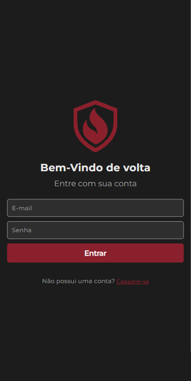
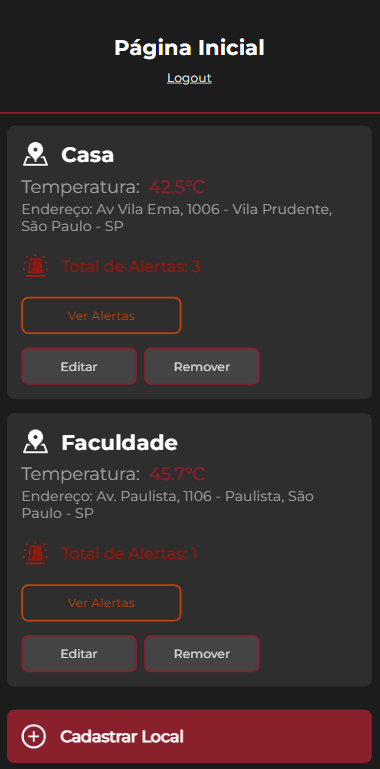
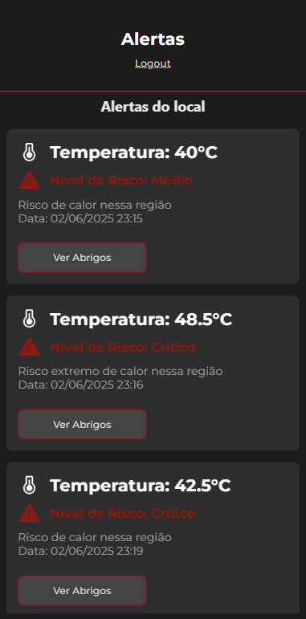
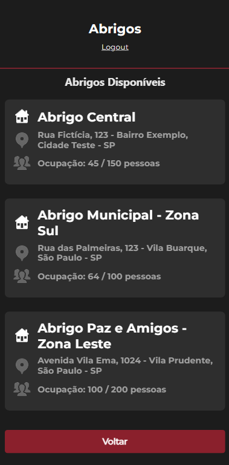

# 🔥 SafeHeat — Aplicativo de Apoio em Situações de Calor Extremo

[](https://github.com/felipesora/safeheat-frontend-mobile)

O **SafeHeat** é uma aplicação mobile criada para auxiliar a população em momentos de **calor extremo**, permitindo o monitoramento de locais cadastrados pelo usuário, exibição de alertas de calor e consulta a abrigos públicos disponíveis. A solução integra duas APIs REST: uma desenvolvida em **Java (usuário, locais, alertas)** e outra em **.NET (abrigos públicos)**.

---

## 👥 Integrantes

- **Felipe Ulson Sora** – RM555462 – [@felipesora](https://github.com/felipesora)
- **Augusto Lope Lyra** – RM558209 – [@lopeslyra10](https://github.com/lopeslyra10)
- **Vinicius Ribeiro Nery Costa** – RM559165 – [@ViniciusRibeiroNery](https://github.com/ViniciusRibeiroNery)

---

## 📱 Funcionalidades do App

- **Login e Cadastro de Usuário**
- **Cadastro e listagem de locais monitorados**
- **Exibição de alertas de calor por local**
- **Consulta de abrigos públicos disponíveis**
- **Navegação fluida entre telas com visual limpo e informativo**

---

## 🧭 Fluxo de Navegação

### 🔐 Login / Cadastro
- Tela inicial de autenticação.
- Após login, redireciona para a tela principal com os locais do usuário.



### 🏠 Tela Inicial (Locais do Usuário)
- Lista de **locais cadastrados** em formato de card:
  - Nome do local
  - Última temperatura registrada
  - Endereço completo
  - Total de alertas recebidos
  - Botões: Ver Alertas | Editar | Remover
- Botão para **cadastrar novo local**, caso não existam registros.



### ⚠️ Tela de Alertas
- Exibe os **alertas relacionados a um local específico**, em formato de card:
  - Temperatura registrada
  - Nível de risco
  - Descrição/mensagem do alerta
  - Data e hora do alerta
  - Botão: Ver Abrigos



### 🛑 Tela de Abrigos Públicos
- Mostra os **abrigos disponíveis** cadastrados pela gestão pública (API .NET):
  - Nome do abrigo
  - Endereço completo
  - Ocupação atual / capacidade total



---

## ⚙️ Tecnologias Utilizadas

### Frontend
- **React Native** com **Expo**
- **TypeScript**
- **React Navigation**
- **Axios** (requisições HTTP)

### Backend
- **API REST Java + Spring Boot**
  - Gerencia usuários, locais e alertas
- **API REST .NET + MVC**
  - Gerencia abrigos públicos
  - Swagger para documentação
  - Banco de dados Oracle via Entity Framework Core

---

## 🗂️ Estrutura de Telas do App

```bash
src/
├── components/ # Cards e headers reutilizáveis
├── screens/ # Login, Home, Alertas, Abrigos
├── services/ # Conexão com APIs Java e .NET
├── types/ # Tipagens com TypeScript
└── App.tsx # Componente principal
```

---

## 🚀 Como Rodar o Projeto

### 📱 Aplicativo Mobile
```bash
git clone https://github.com/felipesora/safeheat-frontend-mobile.git

cd safeheat-app

npm install

npx expo start
```

---

### ☕ API Java (Locais / Alertas / Usuários)

- Repositório: [safeheat-backend-java](https://github.com/felipesora/safeheat-backend-java)

Essa API é responsável por gerenciar o cadastro de usuários, locais monitorados e alertas de calor. O app está configurado para se conectar à API local por padrão:

```ts
// src/services/usuarioService.ts
const api = axios.create({
  // baseURL: 'https://safeheat-backend-java.onrender.com',
  baseURL: 'http://localhost:8080',
});
```

>✅ Para uma experiência local mais rápida, mantenha a baseURL como http://localhost:8080.
>🐢 A opção onrender.com também pode ser utilizada (descomente no código), mas é mais lenta devido ao cold start da hospedagem gratuita.

---

### 💻 API .NET (Abrigos Públicos)

- Repositório: [safeheat-backend-dotnet](https://github.com/felipesora/safeheat-backend-dotnet)

Essa API gerencia os abrigos públicos cadastrados pela gestão pública e é desenvolvida com ASP.NET Core + MVC. Ela oferece endpoints RESTful documentados via Swagger, além de um painel Razor Pages para visualização.

>⚠️ Caso a API .NET não esteja disponível, o app mostra um abrigo fixo como fallback para testes.

---

## 📽️ Vídeo de Demonstração da Solução Completa
Veja o funcionamento completo da solução SafeHeat (Fullstack):

[🔗 Assista à demonstração](https://www.youtube.com/watch?v=zYGh5FbhCwE)

